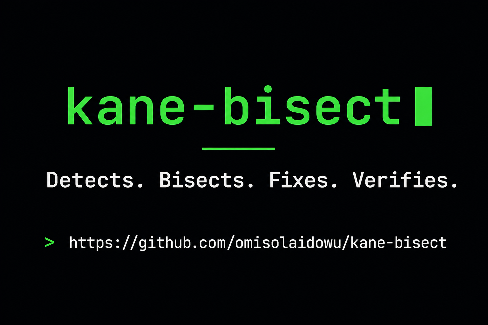
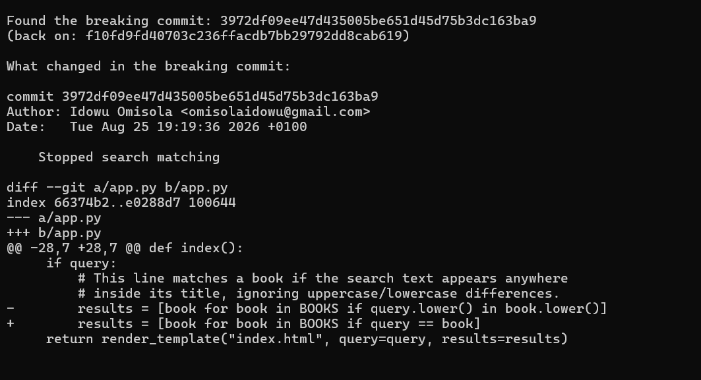
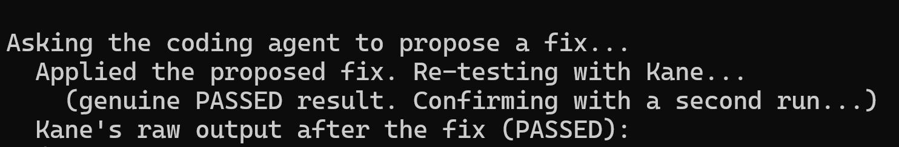
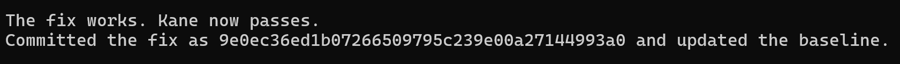

# kane-bisect - Book Search Demo App

**kane-bisect** watches your repo, catches regressions with real browser
tests, finds the exact commit that caused them, and fixes them
automatically. You never need to remember or type a commit hash.

This folder contains a small Flask demo app (one feature: search a list
of books) used as the test subject, plus `kane_bissect.py`, the tool
itself.

## Why this goes beyond a basic auto-bisect

The hackathon brief itself suggests "auto-bisect that walks back through
commits to find the one that broke Kane" as one example idea. This
project starts from that idea but goes further in three ways:

1. **It closes the loop, not just finds the commit.** Once the breaking
   commit is found, the tool asks Claude to propose a fix based on that
   commit's diff and Kane's failure output, applies the fix, re-verifies
   it with Kane, and only commits it once that verification passes. The
   commit is found automatically, and the fix is proposed, applied, and
   proven to work automatically too.
2. **It's self-tracking, not hash-driven.** The tool remembers its own
   baseline and decides on its own when a regression has occurred. The
   only manual step is making a commit and running `check`.
3. **It treats Kane's live verdicts as something to verify, not just
   consume.** Building this surfaced real, repeatable cases where Kane's
   browser check disagreed with itself on identical, unchanged code.
   Section 5 below documents exactly what was found and how the tool
   was made resilient to it, rather than treating a single Kane run as
   ground truth.

## 1. Set up

```bash
python -m venv venv
source venv/bin/activate
pip install -r requirements.txt
npm install -g @testmuai/kane-cli
kane-cli login
kane-cli install skill
```

You'll also need an Anthropic API key (from console.anthropic.com) set
as an environment variable, since the fix step calls Claude directly:

```bash
setx ANTHROPIC_API_KEY "your-key-here"
```
(restart your terminal after this)

## 2. Confirm the app works

```bash
flask --app app run --port 5000
```

Visit http://localhost:5000, search "Clean", confirm "Clean Code" shows
up. Stop the server (Ctrl+C). From here on, `kane_bissect.py` starts
and stops the server itself, so don't run it manually alongside the tool.

## 3. How to use it

There's exactly one command:

```bash
python kane_bissect.py check
```

Run this any time after making a commit.

- **First time ever:** it tests whatever commit you're on. If it
  passes, that becomes the saved baseline.
- **Every time after:** it compares your current commit to the saved
  baseline.
  - Same commit: nothing to do.
  - New commit, still passing: baseline quietly updates.
  - New commit, now failing: it automatically bisects between the
    saved baseline and your current commit to find the exact commit
    that broke things, asks Claude to propose a fix based on that
    commit's diff and Kane's failure output, applies the fix, re-tests
    with Kane, and, if it passes, commits the fix and updates the
    baseline. This entire sequence runs without any commit hashes
    typed by you.

The tool remembers its baseline in `.kane_bissect_state.txt`, which is
git-ignored since it's the tool's own memory, not part of the project.

## 4. Reproducing the demo from scratch
 
This works directly on `main`, no separate branch needed.
 
**1. Add a few small commits, so there's real history to bisect through:**
```bash
echo # helper comment >> app.py
git add app.py
git commit -m "Add helper comment"
 
echo # another note >> app.py
git add app.py
git commit -m "Add another note"
 
echo # one more tweak >> app.py
git add app.py
git commit -m "Add one more tweak"
```
 
**2. Run the tool to set this as the known-good baseline:**
```bash
python kane_bissect.py check
```
This tests the current commit, confirms it passes, and saves it as the
baseline to compare future commits against.
 
**3. Introduce a regression.** Open `app.py` and change:
```python
results = [book for book in BOOKS if query.lower() in book.lower()]
```
to:
```python
results = [book for book in BOOKS if query == book]
```
 
**4. Commit the regression:**
```bash
git add app.py
git commit -m "Simplify search matching"
```
 
**5. Run the tool again to trigger the full loop:**
```bash
python kane_bissect.py check
```
This is where Kane detects the failure, the tool bisects through the
commits made in step 1 to find the exact one that introduced the bug,
hands that commit's diff and Kane's failure output to the coding
agent for a fix, applies the fix, and re-verifies with Kane that the
fix actually works before committing it.

## 5. Reliability notes

Kane CLI's live browser check occasionally disagreed with itself on
identical, unchanged code, in both directions: a false PASS on broken
code, and a false FAIL on working code (usually from the automation
stalling mid-run, or from a transient auth/session error producing no
real result at all). `kane_bissect.py` handles this in a few ways:

- It never trusts a PASSED result, or an inconclusive/stalled FAILED
  result, from a single run. It re-confirms with a second run first.
- It detects when Kane didn't complete a real run at all (for example
  an auth error) and retries, instead of treating that as a genuine
  failure.
- It actively confirms port 5000 is free before starting a new server
  instance and after stopping the old one, instead of assuming a fixed
  delay is enough. A stale leftover server was an early, hard-to-spot
  source of false results during development.

This is a deliberate design choice, not a workaround being hidden. A
single flaky check is a poor foundation for an automated pipeline, so
the tool treats agreement across runs as the real signal of truth.

## 6. Limitations and future work

- **Scoped to one app, by design, for this demo.** `KANE_OBJECTIVE`, the
Flask start command, and the target file (`app.py`) are hardcoded to
this project. Generalizing this, by auto-detecting the start command
from `package.json` or `requirements.txt`, and taking the test
objective as a config file or CLI flag, is the natural next step to
make this work on any repo, not just this one.

- **Tests locally, not against a live deployment.** When bisecting, the
tool checks out each historical commit and spins up a local server to
test it. It does not re-deploy each commit to a real staging or
production environment. So the realistic workflow is: a regression
shows up in production, you reproduce it locally at your current
`HEAD`, and `check` bisects through local history to find the commit
that caused it. True bisecting against production would require a way
to deploy or preview each historical commit, which is a meaningfully
larger project.
 
- **Assumes a bug stays broken once introduced,** the same assumption
regular `git bisect` makes. If a bug is introduced in one commit, then
incidentally masked (without being genuinely fixed) by a later commit,
and reappears afterward, the binary search's halving logic can point
to the wrong commit. Worth being aware of on any repo with a more
tangled commit history than this demo's straight line.
 
- **The auto-fix step trusts a single AI-generated patch.** It re-tests
with Kane before committing, so a fix that doesn't work is caught and
never silently accepted. It does not try multiple candidate fixes, and
it does not ask for human review before committing a passing one. For
a higher-stakes codebase, a mode that proposes a fix without
auto-committing it, or a required human approval step, would be a
safer default.
 
- **Reliability costs speed.** Every genuine PASSED result gets a second
confirmation run before being trusted, and automation stalls or invalid
runs are discarded and retried rather than counted as evidence. This
roughly doubles (sometimes triples) the number of Kane calls per commit
compared to trusting a single run, so a full bisect across several
commits takes noticeably longer than the naive version would. This is
a deliberate trade, correctness over speed, but it's a real cost worth
naming. A tunable option to run in a faster, single-check mode (with a
warning that results are less trustworthy) would be a reasonable
addition for cases where speed matters more than certainty.

## 7. Evidence

Screenshots of a real run, from `images/screenshots/`:

## Bug detected


## Fix proposed and applied


## Kane confirms the fix passes


Kane's own recorded test run for the fixed commit, viewable directly on
the TestMu test manager: [test confirmation](https://test-manager.lambdatest.com/projects/01M0T534WGYTDJ7HEV2CRW3H5X/test-cases/01M0X3DY0SESCG35NJE1YSS7KJ/dashboard/share/US_YE7VVE399LEC1NSG8LE5LMKH72EPWFXF6Q272OJ1Q70EIQ3E136O08IM5AWEQ5KI?type=summary&agentView=true&fqdn=summary-page)

This is Kane's own evidence, not a screenshot of terminal text, so it
can be verified independently of anything in this repo.